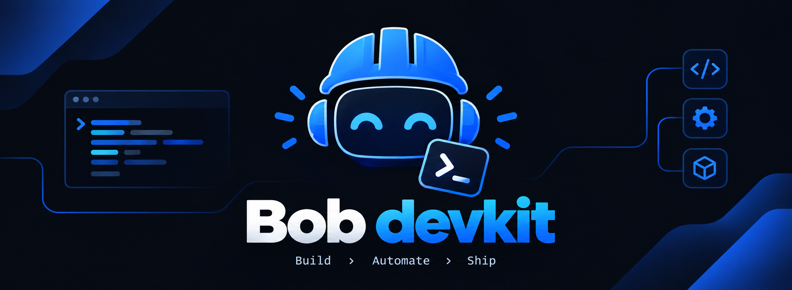

<p align="center">
   Automate > Ship" width="100%">
</p>

# Bob Devkit

Terminal-native AI skills for your agent. Each command ships as a
self-contained **skill** (one folder, one `SKILL.md`), so any agent that
reads a skills directory — IBM Bob, Claude Code, Cursor, Devin,
Windsurf — gets all three after one install.

## Install

**macOS / Linux**

```shell
curl -fsSL https://raw.githubusercontent.com/mrgonzales-dev/ibmbob-hackathon/main/bobdevkit/install.sh | sh
```

**Windows (PowerShell)**

```powershell
irm https://raw.githubusercontent.com/mrgonzales-dev/ibmbob-hackathon/main/bobdevkit/install.ps1 | iex
```

One command does everything — it downloads the package, shows a picker
for the skills, detects your agent's config dir (`.bob/`, `.devin/`,
`.claude/`, `.cursor/`, `.codeium/windsurf/`), and installs.

## Skills

| Skill | What it does |
|---|---|
| `bob-upgrade-check` | Major framework upgrade risk analyzer. Scans a PHP project for the package, code, and config changes a version bump causes. Returns one ranked HIGH/MED/LOW report and an optional phased plan. |
| `bob-impact` | Change impact analyzer. Reads `git diff`, traces the direct callers, database tables, and tests that reference the changed code. Prints one ranked blast-radius report. Add `--regress` to run the affected tests. |
| `bob-pr` | Serves a plan as a GitHub-style pull-request page on localhost. You approve or request changes before any real project file is touched. |
